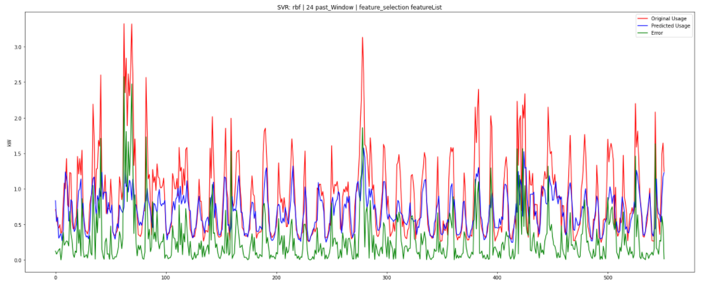

# House Load Demand Forecast

Use machine learning to predict the energy consumption of a household.  
This repository holds some of the code used to test several algorithms in this task.  
This work ultimatly resulted in the available paper that was accepted in the IEEE 8th World Forum on Internet of Things.  

Example using rbf:

